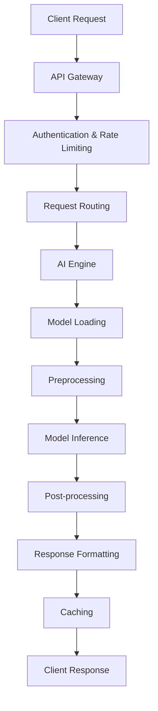
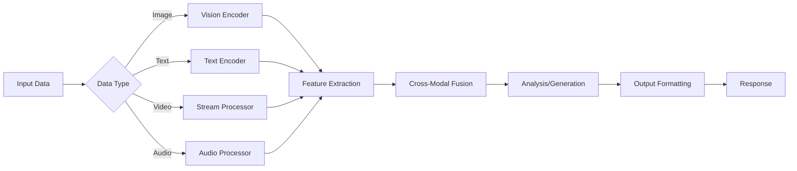

# Multi-Modal AI Content Analyzer - Architecture Documentation

## 🏗️ System Architecture Overview

The Multi-Modal AI Content Analyzer is built as a scalable, enterprise-grade system that combines cutting-edge AI models with production-ready infrastructure. The architecture follows microservices principles with clear separation of concerns.

```
┌─────────────────────────────────────────────────────────────────────────────────┐
│                              Frontend Layer                                     │
├─────────────────────────────────────────────────────────────────────────────────┤
│  React Dashboard  │  Mobile App  │  CLI Tools  │  Jupyter Notebooks  │  APIs   │
└─────────────────────────────────────────────────────────────────────────────────┘
                                        │
┌─────────────────────────────────────────────────────────────────────────────────┐
│                              API Gateway Layer                                  │
├─────────────────────────────────────────────────────────────────────────────────┤
│  FastAPI Server  │  Authentication  │  Rate Limiting  │  Load Balancing       │
└─────────────────────────────────────────────────────────────────────────────────┘
                                        │
┌─────────────────────────────────────────────────────────────────────────────────┐
│                              Core AI Engine                                     │
├─────────────────────────────────────────────────────────────────────────────────┤
│  Multi-Modal    │  Content        │  Stream         │  Model Training         │
│  Analyzer       │  Generator      │  Processor      │  System                 │
└─────────────────────────────────────────────────────────────────────────────────┘
                                        │
┌─────────────────────────────────────────────────────────────────────────────────┐
│                              Model Layer                                        │
├─────────────────────────────────────────────────────────────────────────────────┤
│  Vision Models  │  Language       │  Multi-Modal    │  Custom Trained         │
│  (CLIP, BLIP)   │  Models         │  Fusion         │  Models                 │
│                 │  (GPT, BERT)    │  Networks       │                         │
└─────────────────────────────────────────────────────────────────────────────────┘
                                        │
┌─────────────────────────────────────────────────────────────────────────────────┐
│                              Infrastructure Layer                               │
├─────────────────────────────────────────────────────────────────────────────────┤
│  Redis Cache    │  MongoDB        │  MinIO Storage  │  Monitoring             │
│  Message Queue  │  Database       │  Object Store   │  (Prometheus/Grafana)   │
└─────────────────────────────────────────────────────────────────────────────────┘
```

## 🧠 Core AI Components

### 1. Multi-Modal Analyzer (`src/ai_analyzer.py`)

The heart of the system that provides comprehensive analysis across multiple modalities:

**Key Features:**
- **Vision Analysis**: Object detection, scene understanding, visual sentiment
- **Text Analysis**: NLP, sentiment analysis, entity recognition, embeddings
- **Cross-Modal Understanding**: CLIP-based image-text alignment
- **Multiple Analysis Types**: Quick, comprehensive, detailed, creative

**Architecture:**
```python
class MultiModalAnalyzer:
    ├── Vision Models
    │   ├── CLIP (openai/clip-vit-large-patch14)
    │   ├── BLIP (Salesforce/blip-image-captioning-large)
    │   ├── DETR (facebook/detr-resnet-50)
    │   └── ViT (google/vit-base-patch16-224)
    │
    ├── Language Models
    │   ├── RoBERTa (cardiffnlp/twitter-roberta-base-sentiment-latest)
    │   ├── BERT (dbmdz/bert-large-cased-finetuned-conll03-english)
    │   ├── SentenceTransformer (all-MiniLM-L6-v2)
    │   └── SpaCy (en_core_web_sm)
    │
    └── Analysis Pipelines
        ├── comprehensive_analysis()
        ├── quick_analysis()
        ├── detailed_analysis()
        └── creative_analysis()
```

### 2. Content Generator (`src/content_generator.py`)

Advanced AI-powered content generation system supporting multiple content types:

**Supported Content Types:**
- Text generation (GPT-2, T5)
- Image generation (Stable Diffusion)
- Creative writing
- Technical documentation
- Marketing copy
- Code generation
- Poetry and stories

**Architecture:**
```python
class ContentGenerator:
    ├── Text Generation
    │   ├── GPT-2 Medium
    │   ├── T5 Base
    │   └── Custom Fine-tuned Models
    │
    ├── Image Generation
    │   ├── Stable Diffusion v1.5
    │   ├── DPM Solver Scheduler
    │   └── Memory Optimizations
    │
    └── Specialized Generators
        ├── Creative Writing
        ├── Technical Documentation
        ├── Marketing Copy
        └── Code Generation
```

### 3. Stream Processor (`src/stream_processor.py`)

Real-time processing engine for video, audio, and live streams:

**Capabilities:**
- Real-time video analysis
- Audio processing and feature extraction
- Live stream processing
- Webcam integration
- Batch video processing
- Video summarization

**Processing Pipeline:**
```python
class StreamProcessor:
    ├── Video Processing
    │   ├── Frame Extraction
    │   ├── Real-time Analysis
    │   └── Summary Generation
    │
    ├── Audio Processing
    │   ├── Feature Extraction
    │   ├── Chunk Analysis
    │   └── Temporal Modeling
    │
    └── Live Streaming
        ├── WebSocket Integration
        ├── Buffer Management
        └── Quality Adaptation
```

### 4. Model Training System (`src/training/model_trainer.py`)

Comprehensive training system for custom model development:

**Training Capabilities:**
- Vision model fine-tuning
- Text model fine-tuning
- Multi-modal model training
- Curriculum learning
- Contrastive learning
- Knowledge distillation

**Advanced Features:**
```python
class ModelTrainer:
    ├── Training Techniques
    │   ├── Curriculum Learning
    │   ├── Contrastive Learning
    │   ├── Mixed Precision Training
    │   └── Gradient Accumulation
    │
    ├── Model Architectures
    │   ├── Custom Vision Models
    │   ├── Custom Text Models
    │   ├── Multi-Modal Fusion
    │   └── Cross-Modal Attention
    │
    └── Optimization
        ├── Learning Rate Scheduling
        ├── Early Stopping
        ├── Model Checkpointing
        └── Hyperparameter Tuning
```

## 🔧 Advanced Features

### Cross-Modal Attention Mechanism

Our custom cross-modal attention allows vision and text modalities to interact:

```python
class CrossModalAttention(nn.Module):
    """
    Implements bidirectional attention between vision and text features:
    - Vision-to-Text attention
    - Text-to-Vision attention
    - Residual connections
    - Layer normalization
    """
```

### Hierarchical Fusion Strategy

Multi-level fusion for optimal multi-modal understanding:

```python
# Early Fusion: Concatenation
early_fused = fusion(concat(vision_features, text_features))

# Mid Fusion: Element-wise operations
mid_fused = fusion(vision_features * text_features, vision_features + text_features)

# Late Fusion: Attention-based combination
late_fused = attention_pool([early_fused, mid_fused, late_fused])
```

### Advanced Training Techniques

#### 1. Curriculum Learning
Progressive difficulty scheduling for better convergence:
```python
class CurriculumLearningScheduler:
    def get_difficulty_level(self, epoch):
        progress = epoch / total_epochs
        return min(int(progress * difficulty_levels) + 1, difficulty_levels)
```

#### 2. Contrastive Learning
Multi-modal representation learning:
```python
class ContrastiveLoss(nn.Module):
    def forward(self, vision_features, text_features):
        similarity_matrix = cosine_similarity(vision_features, text_features) / temperature
        return cross_entropy_loss(similarity_matrix, diagonal_labels)
```

## 🚀 Performance Optimizations

### 1. Model Optimizations
- **Torch Compilation**: PyTorch 2.0 compilation for 2-3x speedup
- **Quantization**: Dynamic and static quantization for memory efficiency
- **Pruning**: Structured pruning for model compression
- **Memory Optimization**: Gradient checkpointing, attention slicing

### 2. Infrastructure Optimizations
- **Caching**: Redis for model outputs and intermediate results
- **Batch Processing**: Efficient batch processing for throughput
- **GPU Optimization**: CUDA memory management and optimization
- **Async Processing**: Asynchronous processing for better concurrency

### 3. Deployment Optimizations
- **Docker Containers**: Multi-stage builds for production
- **Load Balancing**: Nginx for request distribution
- **Auto-scaling**: Kubernetes-ready for horizontal scaling
- **Monitoring**: Comprehensive metrics and alerting

## 📊 Data Flow Architecture

### Request Processing Flow



### Multi-Modal Processing Pipeline



## 🔒 Security Architecture

### Authentication & Authorization
- JWT-based authentication
- Role-based access control (RBAC)
- API key management
- Rate limiting per user/endpoint

### Data Security
- Encryption at rest and in transit
- Secure file upload handling
- Input validation and sanitization
- Content moderation

### Infrastructure Security
- Container security scanning
- Network segmentation
- Secrets management
- Audit logging

## 📈 Scalability Design

### Horizontal Scaling
- Stateless service design
- Load balancer distribution
- Database sharding
- Cache clustering

### Vertical Scaling
- GPU resource management
- Memory optimization
- CPU utilization optimization
- Storage optimization

### Auto-scaling Triggers
- CPU/Memory utilization
- Request queue length
- Response time thresholds
- Custom metrics

## 🔍 Monitoring & Observability

### Metrics Collection
- **Application Metrics**: Request rates, response times, error rates
- **Model Metrics**: Inference time, accuracy, resource usage
- **Infrastructure Metrics**: CPU, memory, GPU, network, storage

### Logging Strategy
- Structured logging (JSON format)
- Centralized log aggregation
- Log retention policies
- Error tracking and alerting

### Distributed Tracing
- Request tracing across services
- Performance bottleneck identification
- Dependency mapping
- Error propagation tracking

## 🧪 Testing Strategy

### Unit Testing
- Model component testing
- API endpoint testing
- Utility function testing
- Mock external dependencies

### Integration Testing
- End-to-end workflow testing
- Database integration testing
- External service integration
- Performance regression testing

### Load Testing
- Concurrent user simulation
- Stress testing
- Capacity planning
- Performance benchmarking

## 🔄 CI/CD Pipeline

### Continuous Integration
```yaml
stages:
  - code_quality_check
  - unit_tests
  - integration_tests
  - security_scanning
  - model_validation
  - docker_build
  - deployment_staging
  - e2e_tests
  - deployment_production
```

### Model Deployment Pipeline
- Model validation and testing
- A/B testing framework
- Gradual rollout strategy
- Rollback mechanisms
- Performance monitoring

## 📚 API Architecture

### RESTful API Design
- Resource-based URLs
- HTTP method semantics
- Status code standards
- Pagination support
- Filtering and sorting

### WebSocket Integration
- Real-time analysis streaming
- Live model updates
- Progress notifications
- Bidirectional communication

### GraphQL Support
- Flexible query interface
- Efficient data fetching
- Type-safe schema
- Real-time subscriptions

## 🎯 Future Architecture Enhancements

### Planned Improvements
1. **Federated Learning**: Distributed model training
2. **Edge Computing**: On-device inference capabilities
3. **Multi-Cloud**: Cloud-agnostic deployment
4. **Serverless**: Function-as-a-Service integration
5. **Blockchain**: Decentralized model sharing

### Research Directions
1. **Foundation Models**: Large-scale pre-trained models
2. **Few-Shot Learning**: Rapid adaptation to new tasks
3. **Efficient Architectures**: Mobile-optimized models
4. **Explainable AI**: Enhanced interpretability
5. **Multimodal Reasoning**: Advanced reasoning capabilities

---

This architecture provides a solid foundation for building scalable, maintainable, and high-performance multi-modal AI applications while supporting future growth and innovation.